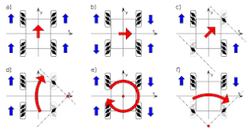

# Robot Base

## Meccanum Wheels:
The aim of using the meccanum wheels is to :-
- Enable omnidirectional movement that allows the robot to move in any direction.
- Increase efficiency by eliminating the need for complicated steering mechanisms or additional hardware.

## Sensors:
1. *Ultrasonic:*
   - For specifying the actual position in the room by using multiple transmitter-receiver pairs positioned at known locations within the room, the system can employ techniques such as triangulation to determine the precise position of objects within the space. This is achieved by comparing the time-of-flight measurements from multiple pairs of transmitters and receivers.
2. *MPU6050:*
   - For balancing and providing acceleration, angle change, and magnetic field on 3 axes x, y, and z with high speed and accuracy as it combines a 3-axis accelerometer and a 3-axis gyroscope in a single package. The accelerometer measures acceleration along the X, Y, and Z axes, while the gyroscope measures angular velocity or the rate of rotation around these axes.

## ROS communication between robot and server:
- Sensors board is responsible for gathering distance measurements from ultrasonic sensors (US) and angle readings from an MPU (presumably an Inertial Measurement Unit). These data are then transmitted to a Raspberry Pi using ROS serial communication protocol.
- Motors board interfaces with motor encoders to track the movement of motors. Like the Sensors Board, it communicates with a Raspberry Pi via ROS serial, providing motor encoder readings.

## STM32 Microcontroller:
The cortex-m3 processor is specifically developed for high – performance, low – cost platforms for a broad range of devices including microcontrollers, automotive body systems, industrial control systems.

    
